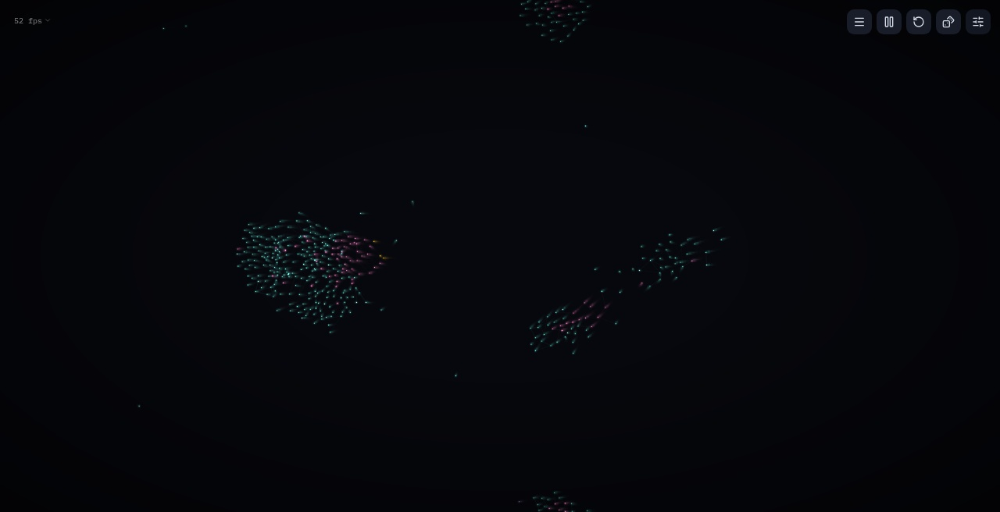

# INGENIUMOWL

Kleine Entwicklerwerkstatt in Österreich. Ich arbeite an Simulationen und nützlichen Tools.

Drei davon kannst du direkt im Browser ausprobieren — ohne Installation.

### Aether

Lebendiges Partikelfeld im Browser — auch am Handy. Individualisiere die Simulation.

[Live](https://markovigele.github.io/aether/) · [Repo](https://github.com/MarkoVigele/aether)

### lifeKI

Simuliere Leben im Browser oder am Handy. Regeln setzen — Veränderungen beobachten.

[Live](https://markovigele.github.io/lifeKI/) · [Repo](https://github.com/MarkoVigele/lifeKI)

### Lumina

Fortschrittlicher Partikelsimulator mit visuellen Effekten und innovativen Interaktions- und Einstellungsmöglichkeiten.

[Live](https://markovigele.github.io/lumina/) · [Repo](https://github.com/MarkoVigele/lumina)

---

Private Tools bleiben privat. Kontakt nur über GitHub — kein Spam.
