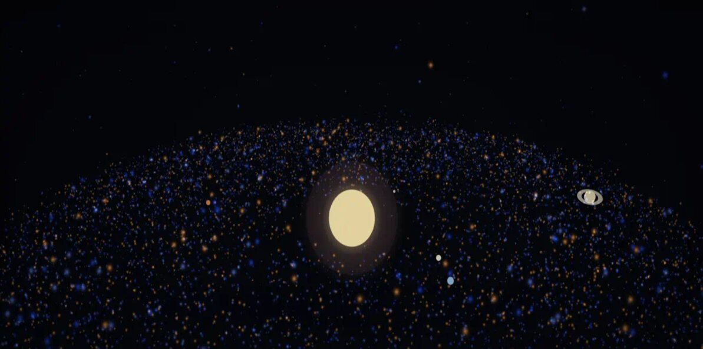
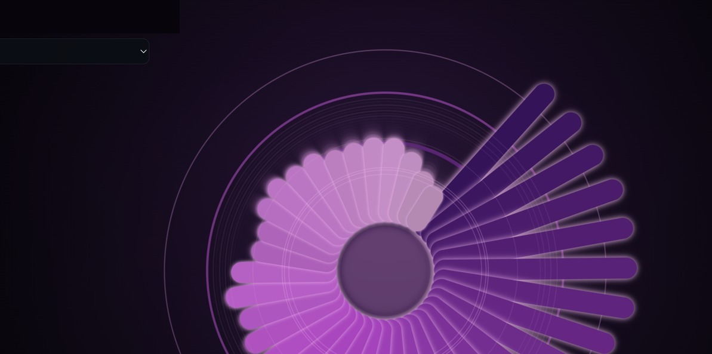

# INGENIUMOWL

Entwickler in Österreich. Sims und Tools.

### Genesis

Vom Urknall zu Planeten. Zeitlinie im Browser: Quarks bis Milchstraße, Sonne und Planeten.

[Live](https://markovigele.github.io/genesis/) · [Repo](https://github.com/MarkoVigele/genesis)

### Aether

Lebendiges Partikelfeld. Farben ziehen oder stoßen. Desktop und Handy.

[Live](https://markovigele.github.io/aether/) · [Repo](https://github.com/MarkoVigele/aether)

### Pulsefield

Sound steuert die Visuals. Mic, Datei oder Tab.

[Live](https://markovigele.github.io/pulsefield/) · [Repo](https://github.com/MarkoVigele/pulsefield)

### Lumina

Partikel mit Effekten, Steuerung und Presets. Direkt im Browser.

[Live](https://markovigele.github.io/lumina/) · [Repo](https://github.com/MarkoVigele/lumina)

